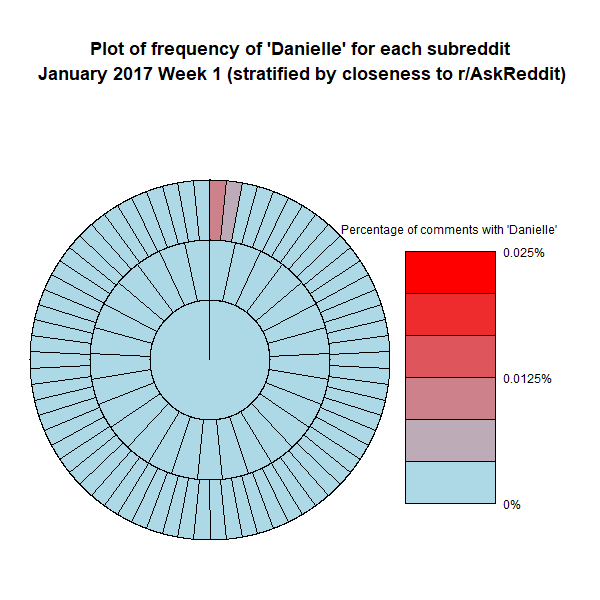
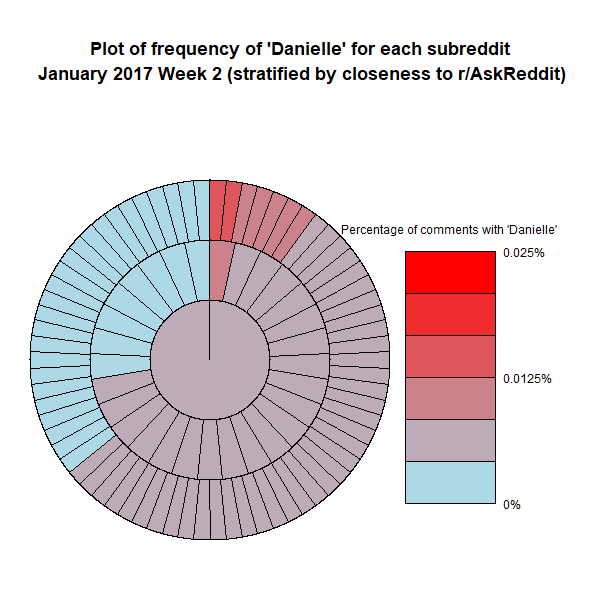
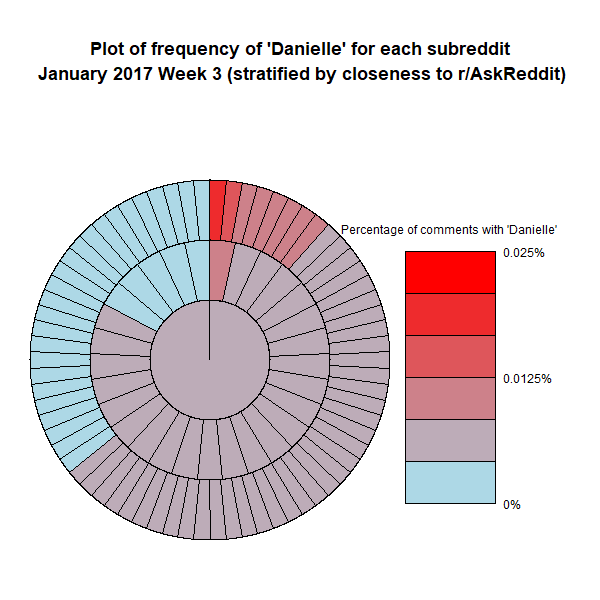
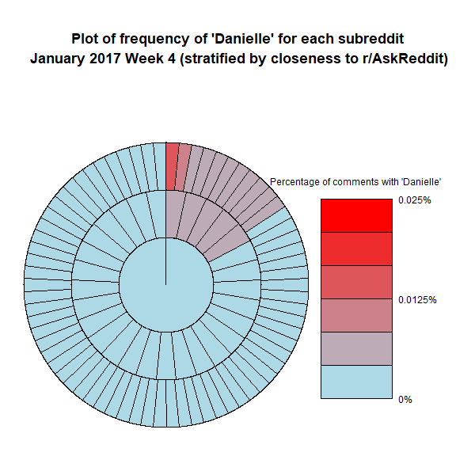

```{r setup, include=FALSE}
knitr::opts_chunk$set(echo = TRUE)
```

#Introduction


Reddit is one of the largest social networks on the internet with over 330 million active monthly users all contributing actively to spread ideas, knowledge, and conversations about any imaginable topic. User interaction within popular forums can have great influence across global communities. In an effort to understand the propagation of information and the evolution of the collective consciousness of the internet, we have decided to study the evolution of memes through the internet, using Reddit as our proxy. Reddit is arguably the best platform for this analysis as it is the primary conduit and originator of memes.  Our data is composed of 6 months data which have an average of 70 million rows with 12 columns per month (reaching 40GB); in total we had 420 million rows of data and 240GB of data which required the development of a private server and data management through an SQL database. Due to the richness and size of the dataset, we have proposed the following objectives.

```{r, echo=FALSE, out.width = '100%'}
knitr::include_graphics("objective.png")
```

Reddit operates as a collection of over a million communities known as subreddits. These are message boards oriented around a topic of interest. Users interact within the subreddits by posting content(images, gifs or text discussion, commenting on posts, and voting.) Examples of content we had access to through JSON files for the monthly data were comment body text, user ID, timestamp, controversiality, subreddit, and score; most were used for some form of analysis for this project. 

#Dataset


#Plots
```{r, echo=FALSE, fig.cap="Comment activity graph in Reddit on December 1st, 2017 UTC(+6:00 CST)", out.width = '100%'}
knitr::include_graphics("commentactivity.png")
```

In this plot, we have analyzed the data for user activity by time of day using timestamps. This data is a Dec 1, 2017 sample from our database. Peak activity is around 12PM and 9PM, which suggests that the user base is biased towards the US, otherwise we would expect a more flat distribution.

```{r, echo=FALSE, fig.cap="Subscriber and Comment Counts", out.width = '100%'}
knitr::include_graphics("subscribercounts.png")
```

This plot shows the number of subreddits with a given amount of subscribers.As expected there is a quick decay as the number of subscribers increases, but there are significant outliers on one end. We determined these are due to auto subscriptions to some subreddits for new accounts. Graphing comments vs subscribers also shows a break in the trend in the outlier region.

```{r, echo=FALSE, fig.cap="Weekly Frequency Wheel Plots of Meme Spread in Top 100 Subreddits", out.width = '100%'}




```


Four weekly frequency wheel plots for the 'Cash Me Ousside, How Bow Dat' meme in January 2017. Color represents the saturation percent of comments (percentage of comments containing the meme). Each sector represents a different subreddit. The center is r/AskReddit, one of the largest subreddits, and the location of one of the first appearances of the meme on Reddit. The inner ring is 29 subreddits most closely related to r/AskReddit, based on cross-commenting activity. The outer ring is 70 other subreddits less closely related to r/AskReddit.

#Discussion

#Conclusion

